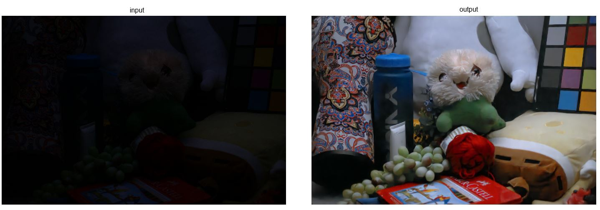

# Deep-Lighting-Network-ONNX

ONNX runtime inference for Low-Light Enhancement (DLN) in Windows C++ environment. 
 


## Requirements
- Windows 10
- Visual Studio 2019
- CUDA 11.1, Cudnn 8
- Python 3.7
- Torch 1.9.0
- OpenCV 4.5.1 with CUDA

## Installation

### Step 1
- Clone Deep-lighting Network and Install the required libraries
``` 
git clone https://github.com/WangLiwen1994/DLN 
```
- Clone this project
```
git clone https://github.com/spacewalk01/Deep-Lighting-Network-ONNX
```
- Move onnx generator to DLN folder and run it
```
move save_model.py $DLN_folder 
cd $DLN_folder
python save_model.py --modelfile models/DLN_finetune_LOL.pth
```
### Step 2
- Open ```LightingNetwork.sln``` with Visual Studio 2019
- Select ```x64``` and ```Release``` for the configuration 
- Right-click on Project and Open ```Manage NuGet Packages```
- Search ```onnxruntime-gpu``` and install it by clicking ```down-arrow```.
- Setup Opencv on Properties
- Build and run the project

## Test Dataset
Low-light dataset can be downloaded from [here](https://daooshee.github.io/BMVC2018website/).
